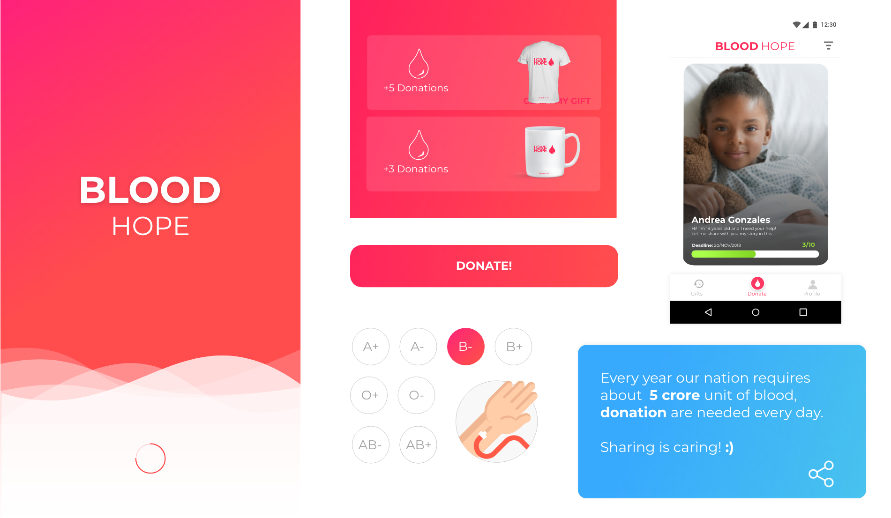

# BloodHope

This app will help people who need blood, with those amazing people who are able to donate! All of this through crowfunding of blood, sharing causes and reach people all over the world, Connecting Blood Banks and connect lives. _We don't give people a tool, we give them **HOPE**_



##Description
- App File Name : [Link](https://github.com/GrowCallisaya/BloodHope/executable_folder)
- Team Name : KantutaApp
- Country : Bolivia
- Author’s  :  1. Grover Callisaya [Link](https://github.com/GrowCallisaya)
 			   2. Fabiola Acarapi [Link](https://github.com/fabiola29298)	
- Video: [Link]( )
- Short Description : This app will help people who need blood, with those amazing people who are able to donate 
- General Description : BlodeHope is a mobile application to connect donors with people who need blood. 
41% of blood donations come from voluntary and altruistic donors in Latin America and the Caribbean. We can reverse the situation by donating blood periodically using BloodHope to connect donors with people who need blood, with each unit of blood you can save three people.
*How it Works*
As a person who need blood, you can create a cause, describe personal data, deadline, hospital, city, type of blood, photo, your story and can see the collaborators who joined your cause by donating blood.
As a donor, you can see all different causes, share the causes by social networks, join the cause by donating blood in the blood bank where you need it and contact you by WhatsApp or Email.
*How will increase donors in the community?*
we will conect donors with causes acording type blood and location, encourage donors through points that accumulate for each donation and with them you can get t-shirts and cups and share the causes in social networks with friends to make the community grow.
*Our vision of the application*
Support the increase of volunteer donors in Latin America mainly.
Support voluntary donation systems as a way to promote caring for others and community cohesion.
When the database grows to a considerable size we can use meaching Learning and predict the high and low demand of each blood type per month according to the city, so notify in the time of less demand according to the blood type of the donors.

######  Development Components
- Firebase Authentication
- Google and Facebook API Authentication
- MapBox 
- Whatsapp and Email Intent Builders


######  UI Components 
- Tab Bottom Navigation Widget
- Butterknife
- Picasso 
- FancyButtons 
- CircleImageView
- Custom TextView with custom `Montserrat Font`
- RoundCornerProgressBar
- CustomGauge for Progress
- Infinitecycleviewpager


## Guide

In order to build this project follow the next steps:
1. Create an Firebase Project
2. Create a Facebook App as in [https://developers.facebook.com]
3. Change de FACEBOOK ID in 

```
    <string name="facebook_app_id">[YOUR_FACEBOOK_ID]</string>
    <string name="fb_login_protocol_scheme">fb[YOUR_FACEBOOK_ID]</string>
```

 

## Note

This app is participating in the IEEEmadC challenge. We're in developing progress, so feel free to contact me if you want to contribute to the cause.
`grover.callisaya.dg@gmail.com`
